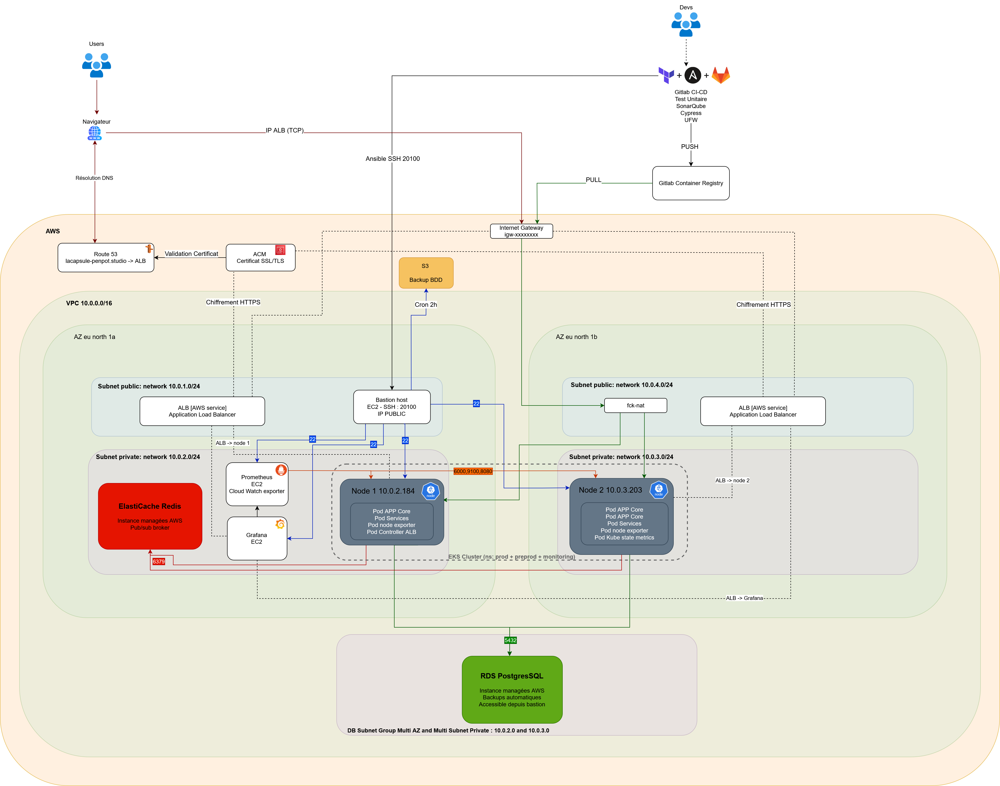
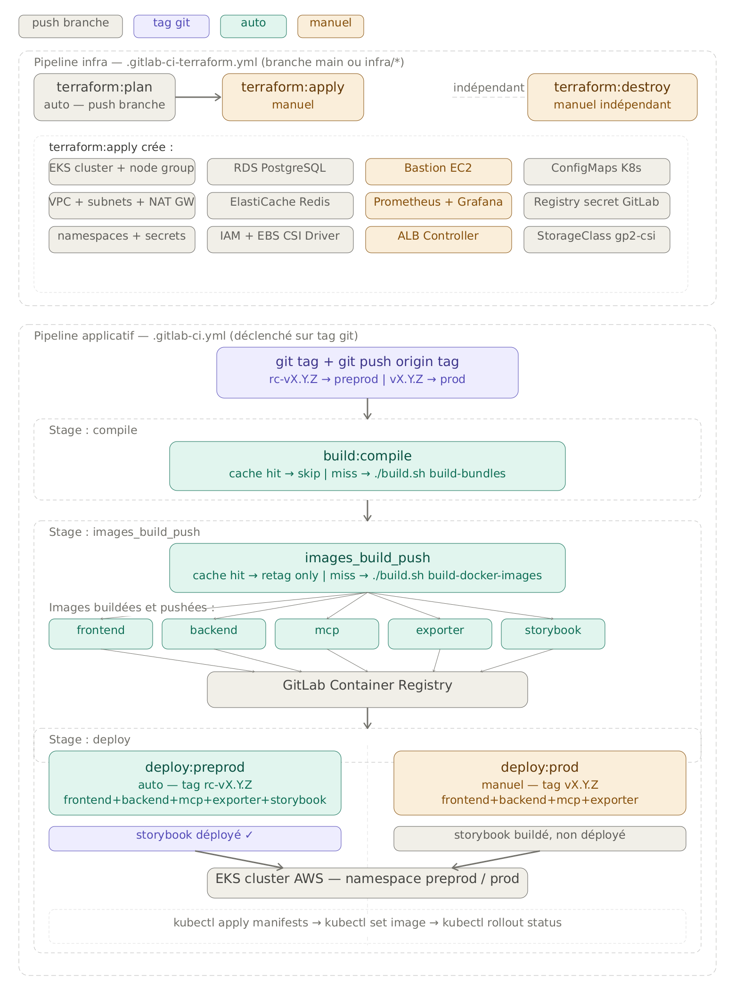
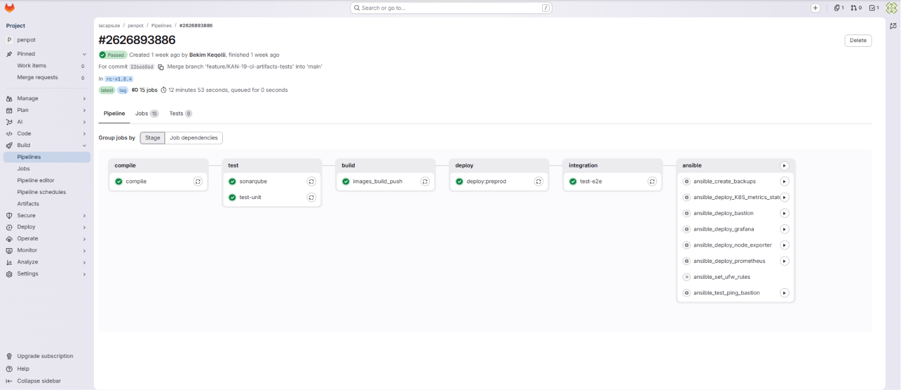
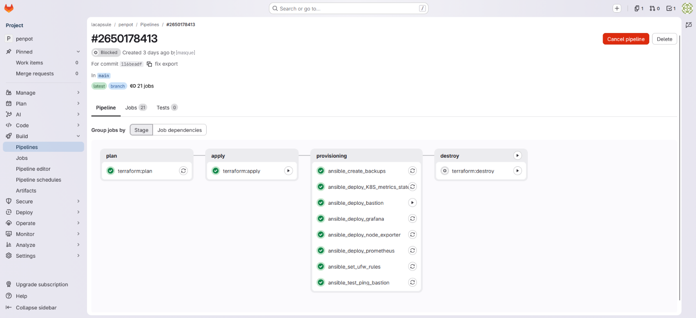
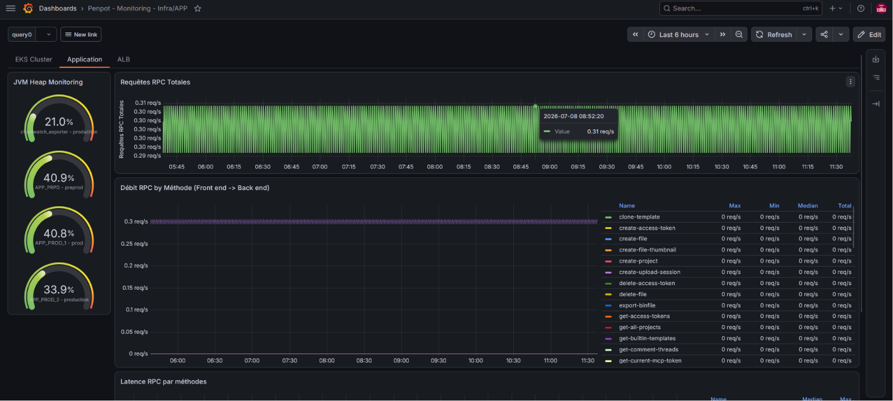
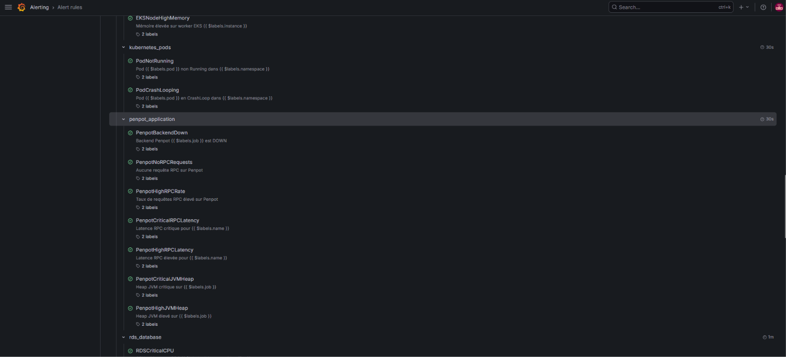
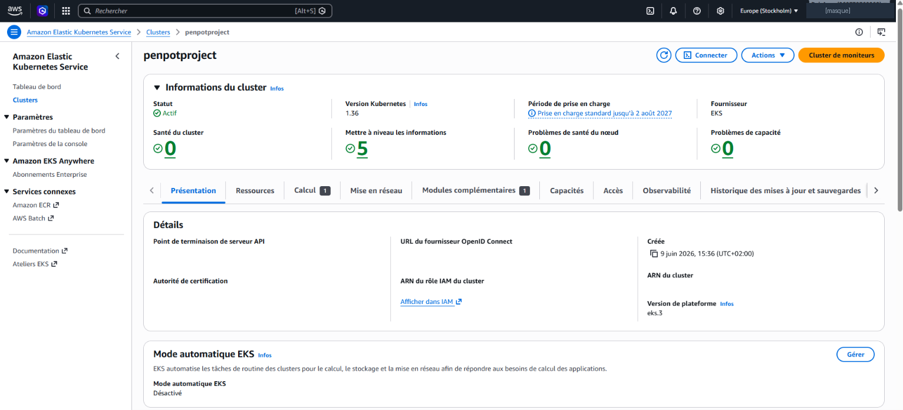
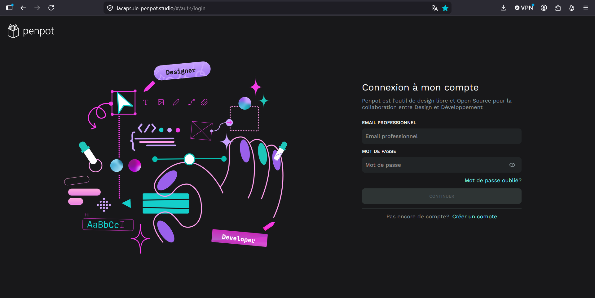

# Penpot sur AWS — infrastructure, déploiement continu et supervision

Déploiement d'une plateforme **[Penpot](https://penpot.app)** (alternative open source à Figma) sur **AWS** : infrastructure entièrement décrite en code, chaîne CI/CD pilotée par les tags, supervision autonome et sauvegardes automatisées.

Projet de fin de formation **Administrateur système DevOps** (TP-01414, La Capsule), réalisé **en équipe de trois**.



> **L'intégralité de cette architecture est provisionnée par Terraform** — VPC, sous-réseaux, tables de routage, cluster EKS, bases RDS, cache Redis, ALB, rôles IAM, buckets S3, instances EC2. Rien n'est créé à la main dans la console AWS.

---

## 👥 Une réalisation collective

Projet mené **à trois**. Ce dépôt rassemble le travail de l'équipe, publié à des fins de portfolio.

| Contributeur | Domaine principal |
|---|---|
| **Arnaud** | Terraform, Ansible, supervision |
| **Walid** | Conteneurisation Docker, cluster EKS |
| **Bekim Keqolli** | Pipelines CI/CD, tests, intégration |

Ma contribution a porté sur la **chaîne CI/CD applicative** (les 5 stages, le cache par empreinte SHA-256, le déclenchement par tag), les **tests** (SonarCloud, Vitest, Cypress) et l'**intégration** des briques entre elles.

---

## 🎯 Le besoin

Héberger Penpot en autonomie, sur une infrastructure maîtrisée, avec :

- deux environnements **isolés** (production et préproduction)
- une infrastructure **reproductible** — détruite et recréée à l'identique en une commande
- un **déploiement continu** déclenché par le versionnage
- une **supervision avec alerte** qui survit à une panne du cluster
- des **sauvegardes automatisées** avec des objectifs de reprise définis

---

## 🏗️ Vue d'ensemble

| Couche | Composants |
|---|---|
| **Réseau** | VPC `10.0.0.0/16` sur **2 zones de disponibilité** · 4 sous-réseaux (2 publics, 2 privés) · Internet Gateway · passerelle NAT |
| **Calcul** | **EKS 1.36**, 2 nœuds `t3.medium` (un par zone) |
| **Données** | 2× **RDS PostgreSQL** (`db.t3.micro`) · **ElastiCache Redis** |
| **Exposition** | **ALB** *internet-facing* · certificat **ACM** wildcard · **Route 53** |
| **Supervision** | **Prometheus**, **Grafana**, **Alertmanager** sur EC2, **hors du cluster** |
| **Accès** | Bastion durci (port SSH non standard, rebond **ProxyJump**) |

**Principe directeur : la défense en profondeur.** Seul le frontend est exposé publiquement. Les nœuds, les bases et le cache n'ont aucune adresse publique — ils sortent vers Internet par la passerelle NAT, mais rien n'entre.

---

## 🛠️ Stack

`AWS` · `Terraform` · `Ansible` · `Kubernetes (EKS)` · `Docker` · `GitLab CI/CD` · `Prometheus` · `Grafana` · `Alertmanager` · `PostgreSQL` · `Redis` · `Cypress` · `Vitest` · `SonarCloud`

## 📁 Structure

```
penpot-infra/
├── terraform/   21 fichiers .tf — « un domaine, un fichier »
├── ansible/     8 playbooks idempotents + inventaire dynamique
├── ci/          pipelines GitLab (applicatif + infrastructure)
├── k8s/         manifestes Kubernetes (prod / preprod)
└── tests/       Cypress (end-to-end)
```

> Ce dépôt est l'extrait **`penpot-infra/`** d'un monorepo qui contenait aussi le code applicatif de Penpot (récupéré en amont, non modifié). C'est pourquoi les chemins des fichiers CI référencent `penpot-infra/`.

---

# 1️⃣ Automatiser l'infrastructure

## Terraform — toute l'infra en code

**Terraform provisionne l'ensemble de l'architecture décrite plus haut.** Chaque ressource AWS du schéma — réseau, calcul, données, exposition, identités, stockage — est déclarée en code : aucune création manuelle dans la console.

**21 fichiers `.tf`**, organisés selon le principe « un domaine, un fichier » (`vpc.tf`, `eks.tf`, `rds.tf`, `elasticache.tf`, `alb.tf`, `iam.tf`, `s3.tf`, `security_groups.tf`, `routage.tf`…). L'infrastructure complète se détruit et se recrée **à l'identique en une commande**, en une quinzaine de minutes — ce qui a permis de l'éteindre entre les phases de travail pour ne pas payer inutilement.

Deux garde-fous :

- **L'état est distant et verrouillé.** Le `tfstate` est stocké sur le backend HTTP de GitLab, et un **verrou** empêche deux `apply` de s'exécuter simultanément — donc pas de dérive ni d'état corrompu.
- **Les secrets sont générés, jamais écrits.** `random_password` produit le mot de passe PostgreSQL et la clé applicative, que Terraform injecte ensuite directement dans des secrets Kubernetes. Aucun identifiant en clair dans le code.

## Le réseau — ce qui sort, ce qui n'entre pas

Le VPC est découpé en **4 sous-réseaux sur 2 zones** :

- **2 publics** — l'ALB, le bastion et la passerelle NAT
- **2 privés** — les nœuds EKS, RDS et Redis, **sans aucune adresse publique**

Tout tient dans **deux tables de routage** : la publique envoie `0.0.0.0/0` vers l'**Internet Gateway**, la privée vers la **passerelle NAT**. Les machines privées peuvent donc *sortir* (télécharger leurs images, appeler des API) sans être *joignables*.

## Une passerelle NAT à 6 $ au lieu de 35 $

Les nœuds privés doivent atteindre Internet pour télécharger leurs images. La **NAT Gateway** managée d'AWS coûte ~35 $/mois. Le module **fck-nat** rend le même service sur une instance `t4g.micro` pour ~6 $ — **environ 83 % d'économie** sur ce poste, avec un point de défaillance unique assumé (le module propose un mode HA, non activé ici).

La route `0.0.0.0/0` de la table privée n'est d'ailleurs pas écrite en dur : c'est le module qui l'injecte (`update_route_tables = true`), ce qui évite un conflit de gestion.

## Le parcours d'une requête, du DNS au conteneur

1. **Route 53** résout `lacapsule-penpot.studio` vers l'**ALB**
2. L'ALB est **`internet-facing`** : c'est ce réglage (et pas seulement le sous-réseau public) qui lui attribue une IP publique
3. Il **termine le HTTPS** avec un certificat **ACM wildcard**, valable pour tous les sous-domaines
4. Grâce à l'annotation **`target-type: ip`**, il route **directement vers l'IP du pod**, sans passer par un NodePort ni `kube-proxy` — un saut réseau de moins
5. Dans le pod, le **frontend nginx** aiguille selon le chemin ; un appel `/api` part vers le conteneur **backend** (port `6060`)
6. Le backend lit dans **PostgreSQL**, la session dans **Redis**

**Seul le frontend est exposé.** Le backend et l'exporter restent en `ClusterIP`, internes au cluster.

À noter : l'ALB n'est **pas déclaré directement** en Terraform. C'est l'**AWS Load Balancer Controller**, installé par Helm dans le cluster, qui surveille les ressources `Ingress` et provisionne l'ALB côté AWS.

## Ansible — configurer ce que Terraform a provisionné

**Terraform provisionne, Ansible configure.** 8 playbooks **idempotents** — rejouables sans effet de bord : durcissement du bastion, pare-feu UFW, Prometheus, Grafana, les trois exporters, et les sauvegardes.

Trois points qui ont demandé du travail :

- **Un inventaire dynamique.** Les adresses IP changent à chaque recréation de l'infrastructure. L'inventaire est donc **généré à l'exécution**, en interrogeant l'API AWS pour récupérer les adresses réelles du bastion, de Prometheus et de Grafana.
- **Un accès par rebond.** Les hôtes privés ne sont pas joignables directement : Ansible les atteint via **ProxyJump** à travers le bastion.
- **Une configuration SSH validée avant application.** Chaque directive du durcissement passe par **`sshd -t`** avant rechargement du service : une configuration invalide est rejetée *avant* d'être appliquée, ce qui rend impossible de se verrouiller dehors.

**Ansible Galaxy.** L'installation de Prometheus, Grafana et l'interaction avec Kubernetes ne sont pas réécrites à la main : le pipeline installe les **collections officielles** `prometheus.prometheus`, `grafana.grafana` et `kubernetes.core`. On s'appuie sur des rôles maintenus en amont plutôt que de réinventer — et de devoir les maintenir ensuite.

---

# 2️⃣ Déployer en continu

## Conteneurisation — 5 images depuis l'amont

Penpot n'est pas monolithique : **5 composants**, donc 5 images (frontend `8080`, backend `6060`, exporter `6061`, serveur MCP `4401/4402`, Storybook `6006`).

**Le choix structurant : partir des Dockerfiles *upstream* de Penpot**, sans les réécrire ni maintenir un fork. On reste aligné sur le projet amont et on suit ses montées de version sans effort — la même logique que les collections Ansible Galaxy plus haut : s'appuyer sur ce qui est maintenu en amont. Ce qui est à nous : le **ré-étiquetage** avec nos versions et la **publication dans un registre privé** (GitLab Container Registry), que les pods tirent par tag via un secret `dockerconfigjson`.

Côté durcissement, le frontend est bâti sur **`nginx-unprivileged`** — il ne tourne donc pas en `root`.

## Kubernetes — mettre à jour sans couper le service

**Deux namespaces cloisonnés** (prod et préprod) partagent le même calcul. Le `Deployment` **`app-core`** regroupe frontend, backend et MCP dans un même pod, en **2 réplicas** en production.

La mise à jour se fait en **`RollingUpdate`** avec `maxSurge: 0` et `maxUnavailable: 1` : les pods sont remplacés **un par un**, **sans jamais créer de pod supplémentaire** — donc sans réclamer de capacité en plus — et **sans coupure**.

Le stockage persistant est un volume **EBS** en `ReadWriteOnce` : il ne se monte que sur un nœud à la fois.

## Le tag pilote le déploiement

Un dépôt unique contient l'infrastructure et l'application : **un même tag identifie l'appli et l'infra qui va avec**, donc aucune désynchronisation possible entre ce qui est déployé et ce qui le porte.

- `rc-v*` → **préproduction**, automatique
- `v*` → **production**, après validation humaine (`when: manual`)
- Le format est verrouillé par une expression régulière : **`/^v\d+\.\d+\.\d+$/`** — un tag mal formé ne déclenche rien



## Un cache par empreinte pour ne pas recompiler pour rien

Le stage `compile` calcule un **hash SHA-256** de l'ensemble du code source. Si l'empreinte n'a pas bougé depuis le passage précédent, la compilation et le build sont **court-circuités** : les bundles sont réutilisés depuis le cache, les images simplement ré-étiquetées.

**5 stages applicatifs** (`compile` → `test` → `build` → `deploy` → `integration`), **7 jobs** chaînés par `needs`.



## Un déploiement qui refuse d'être à moitié appliqué

`kubectl set image` bascule chaque conteneur sur l'image du tag, puis **`kubectl rollout status --timeout=20m`** vérifie que les pods deviennent sains. **S'ils ne le deviennent pas, le job échoue** — pas de mise en production partielle.

Deux verrous avant la prod : le **format du tag** (la regex), et une **validation humaine** (`when: manual`).

## Qualité & tests

Trois niveaux de contrôle, joués **avant** toute mise en production :

- **SonarCloud** analyse ~107 000 lignes en statique. Il est délibérément **informatif et non bloquant** : le code analysé est celui de Penpot, en amont — on ne va pas bloquer notre chaîne sur du code qu'on ne maintient pas.
- **Vitest** — 148 tests unitaires sur le module `text-editor`
- **Cypress** — 3 scénarios *end-to-end* joués contre la **préproduction réelle** : affichage du login, connexion, rejet d'un mauvais mot de passe

## Le plan d'infrastructure est un artefact

L'infrastructure a sa propre chaîne, en deux temps. `terraform:plan` calcule le plan et l'**enregistre en artefact**. `terraform:apply`, **manuel**, ne recalcule rien : il consomme cet artefact.

**Ce qui est appliqué est exactement ce qui a été relu** — aucun écart possible entre la validation et l'exécution.

Ensuite, 8 jobs Ansible s'enchaînent par `needs` — avec le **pare-feu UFW appliqué en dernier**, pour ne pas couper les déploiements en cours.



---

# 3️⃣ Superviser

## Une supervision qui survit au cluster

Prometheus, Grafana et Alertmanager tournent sur des **EC2, en dehors du cluster**. Si le cluster tombe — précisément le moment où l'alerte compte — la supervision reste debout et notifie.

- Collecte toutes les **15 s** sur **9 cibles**, rétention **30 jours**
- **3 exporters** : Node Exporter (ressources), kube-state-metrics (état des objets Kubernetes, en **lecture seule** — verbes `list` et `watch` uniquement), CloudWatch Exporter (services managés)
- Configuration **décrite en code** : scraping en YAML, dashboards Grafana provisionnés en **JSON versionné** — rien n'est cliqué à la main dans l'interface



## Anatomie d'une alerte

**40 règles** réparties en 6 groupes. Chacune tient en trois champs : `expr` (la condition, en PromQL), `for` (la durée pendant laquelle elle doit rester vraie — ce qui filtre les pics passagers et évite les fausses alertes) et `severity` (qui pilote le routage).

Une règle à part : le **Watchdog**, volontairement **toujours active**. Tant qu'on reçoit son e-mail, on sait que toute la chaîne — de Prometheus à Alertmanager jusqu'à la boîte de réception — fonctionne.



## Superviser ce sur quoi on ne peut rien installer

RDS, ElastiCache et l'ALB sont **managés** : aucun accès à l'OS, donc impossible d'y poser un exporter. Trois briques critiques dans un angle mort.

La démarche a consisté à établir que leurs métriques existent nativement dans **CloudWatch**, puis à distinguer deux familles d'exporters : ceux de type **agent** (installés sur l'hôte — inapplicables ici) et ceux de type **passerelle**, qui interrogent une API distante.

La solution : le **CloudWatch Exporter**, déployé sur l'instance Prometheus. Il interroge l'**API CloudWatch** avec un rôle IAM en lecture seule et réexpose les métriques comme une cible de scraping classique.

> L'enseignement : distinguer une métrique accessible **par agent** d'une métrique accessible **uniquement par API**.

## Sauvegarde & reprise

| Niveau | Mécanisme | RPO | RTO | Cas d'usage |
|---|---|---|---|---|
| 1 | Snapshots RDS + journaux de transaction (**PITR**) | ~5 min | ~30 min | Sinistre majeur, base corrompue |
| 2 | `pg_dump` chiffré vers **S3** (nocturne, rotation 7 j) | ~24 h | ~1 h | Erreur ciblée, table supprimée |

Le premier restaure **toute la base** à une minute près. Le second permet une reprise **granulaire** — ré-extraire une seule table sans rembobiner l'ensemble. Le bucket est chiffré en `AES256`, accès public bloqué, le tout décrit en Terraform.

---

## 🔐 Sécurité — quatre couches indépendantes

- **Réseau** — security groups en *deny* par défaut : PostgreSQL et Redis joignables uniquement depuis le VPC, l'ALB seul à exposer `80/443`
- **Système** — bastion durci (authentification par clé, `root` désactivé, port SSH non standard, validation `sshd -t`) plus une seconde couche **UFW**
- **Secrets** — générés et injectés par Terraform, Grafana via **Ansible Vault**, jetons CI en variables masquées
- **Chiffrement** — RDS et S3 chiffrés **au repos**, HTTPS wildcard ACM en transit

**IRSA — des identités sans clé statique.** Les contrôleurs qui pilotent AWS depuis le cluster — le **contrôleur ALB** et le **pilote EBS CSI** — s'authentifient via un fournisseur **OIDC** reliant le cluster à IAM. Chacun obtient des identifiants **temporaires** liés à un ServiceAccount précis, avec une politique de confiance qui n'accepte que lui. Aucune clé d'accès stockée dans le cluster.

---

## ✅ Résultat

Penpot déployé en production, servi en **HTTPS**, de bout en bout par la chaîne CI/CD sur une infrastructure entièrement décrite en code.




---

## ⚠️ Limites assumées et pistes d'amélioration

Ce projet a été dimensionné pour un périmètre précis (~10 utilisateurs). Les points suivants sont des **choix conscients**, pas des oublis — les documenter fait partie du travail.

**Dimensionnement fixe.** Le groupe de nœuds est en `min 1 / desired 2 / max 3`, ce qui est un **plafond manuel** : aucun autoscaler n'est configuré (ni HPA, ni Cluster Autoscaler). Un test de charge permettrait d'abord de **mesurer** la capacité réelle ; l'autoscaling viendrait ensuite, si le besoin le justifiait.

**Haute disponibilité partielle.** L'ALB est managé donc redondant, et les deux nœuds sont répartis sur deux zones — mais le volume **EBS en `ReadWriteOnce`** ne se monte que sur un nœud, ce qui y épingle les réplicas. Une vraie HA multizone passerait par **EFS** (`ReadWriteMany`), un **RDS multi-AZ** et un **fck-nat en mode HA**.

**RDS mono-AZ.** Choix de coût assumé. Le *subnet group* couvre deux zones parce qu'AWS l'exige à la création — ce n'est pas une réplication.

**Chaîne d'approvisionnement des images.** Ni scan de vulnérabilités (**Trivy**), ni signature (**Cosign**) vérifiée à l'admission. Trivy serait la première brique à ajouter : il scannerait aussi le code Terraform.

**Gestion des secrets — `random_password` ne suffit pas.** Nous avons choisi de faire **générer** les secrets par Terraform (`random_password`) plutôt que de les écrire dans le code : plus aucun mot de passe en dur, et un secret différent à chaque environnement. C'est un vrai progrès, mais nous avons identifié en cours de route que **c'est un mécanisme de génération, pas de gestion** :

- le secret généré est **stocké en clair dans le `tfstate`** — protégé par l'authentification du backend, mais présent ;
- il n'est **jamais tourné** : généré une fois, il reste valable indéfiniment ;
- **aucun journal** ne trace qui y accède ;
- et la gestion est éclatée sur **trois mécanismes** (Terraform, Ansible Vault pour Grafana, variables masquées de CI).

La suite logique est un gestionnaire dédié : **HashiCorp Vault**, ou — plus proportionné dans une infrastructure déjà 100 % AWS — **AWS Secrets Manager**, qui gère nativement la rotation et s'intègre à IAM. L'apport décisif serait de passer d'identifiants **statiques** à des identifiants **dynamiques et à durée de vie courte**, en particulier pour l'accès à la base.

**Canaux d'alerte.** Alertmanager ne notifie que par e-mail ; l'ajout d'autres canaux est identifié.

---

## 💤 État actuel

**L'infrastructure a été volontairement détruite** à la fin du projet pour ne plus générer de coûts AWS. C'est précisément ce que permet l'infrastructure en code : le socle se recrée en une quinzaine de minutes.

Les captures de ce dépôt documentent l'infrastructure telle qu'elle tournait réellement.

---

## 📄 À propos de ce dépôt

Publié à des fins de **démonstration de compétences**. Il ne contient aucun secret : les identifiants sont générés par Terraform ou injectés depuis des variables de CI, et l'état Terraform n'y a jamais figuré.

Le code applicatif de Penpot n'est pas inclus — il appartient au [projet Penpot](https://github.com/penpot/penpot), sous licence MPL 2.0.
